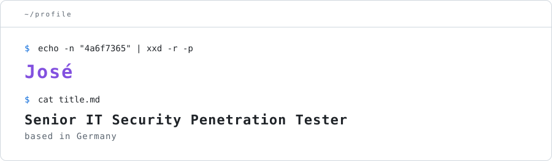

  <picture>
    <source media="(prefers-color-scheme: dark)" srcset="assets/header-dark.svg">
    
  </picture>

  Senior IT Security Penetration Tester, based in Germany

<h3>
  <picture>
    <source media="(prefers-color-scheme: dark)" srcset="assets/label-latest-blog-dark.svg">
    
  </picture>
</h3>

<!--
  The block below is rewritten by .github/workflows/update-readme.yml.
  Everything between :start and :end is DESTROYED on every run. Edit
  outside the markers only. The markers themselves must survive; the
  script exits non-zero if it cannot find them.
-->

<!-- blog-posts:start -->
- [How to decrypt a “Zero-Knowledge” Vault Without the Master Password](https://not4a6f7365.medium.com/b746de6fddeb)
<!-- blog-posts:end -->

<h3>
  <picture>
    <source media="(prefers-color-scheme: dark)" srcset="assets/label-current-projects-dark.svg">
    
  </picture>
</h3>

- [agentic-bug-bounty-framework](https://github.com/Maybe4a6f7365/agentic-bug-bounty-framework): multi-target vulnerability research framework.
- [GlyphLock](https://github.com/Maybe4a6f7365/GlyphLock): android live-wallpaper that renders notifications using the wallpaper's own source glyphs.

<h3>
  <picture>
    <source media="(prefers-color-scheme: dark)" srcset="assets/label-side-projects-dark.svg">
    
  </picture>
</h3>

- [shithead](https://github.com/Maybe4a6f7365/shithead): production card game PWA at [shead.online](https://shead.online).
- [reset-applock](https://github.com/Maybe4a6f7365/reset-applock): a finding about xiaomi app lock, plus a small script to clear it.
- [social-media-content-analyzer](https://github.com/Maybe4a6f7365/social-media-content-analyzer): LLM pipeline that classifies posts. proof-of-concept.
- [fastfetch-gif-support](https://github.com/Maybe4a6f7365/fastfetch-gif-support): fastfetch fork with animated GIF rendering.
- [PwnHub](https://github.com/Maybe4a6f7365/PwnHub): bash-stack CTF platform. exercise.
- [boxtracking](https://github.com/Maybe4a6f7365/boxtracking): flask + opencv motion tracker for videos.
- [CVE-2021-41773](https://github.com/Maybe4a6f7365/CVE-2021-41773): apache path traversal PoC.
- [MalwareDetection](https://github.com/Maybe4a6f7365/MalwareDetection): powershell triage script for compromised windows hosts.

<h3>
  <picture>
    <source media="(prefers-color-scheme: dark)" srcset="assets/label-contact-dark.svg">
    
  </picture>
</h3>

not4a6f7365@wearehackerone.com

[linkedin](https://www.linkedin.com/in/jose-m-matas-not4a6f7365)
